# 🛡️ Hardened Industrial IoT Secure Development Lifecycle (SDL) Pipeline

An open-source reference implementation of a **Secure Development Lifecycle (SDL)** for an Operational Technology (OT) Edge Gateway application. This project is specifically architected to demonstrate compliance with international industrial cybersecurity standard **IEC 62443-4-1** and the **EU Cyber Resilience Act (CRA)**.

---

## 🏗️ Architecture Overview

```mermaid
graph LR
    A[Code Repository] --> B[Static Analysis SAST]
    B --> C[Programmatic CycloneDX SBOM]
    C --> D[Image Vulnerability Scan]
    D --> E[Hardened Docker Runtime]

    style A fill:#23272e,stroke:#3b4252,stroke-width:2px;
    style B fill:#23272e,stroke:#81a1c1,stroke-width:2px;
    style C fill:#23272e,stroke:#a3be8c,stroke-width:2px;
    style D fill:#23272e,stroke:#ebcb8b,stroke-width:2px;
    style E fill:#23272e,stroke:#bf616a,stroke-width:2px;
```




The pipeline acts as an automated governance engine that ensures no unvetted dependencies or configuration flaws hit the factory floor.

### Core Security Components Included:
*   **Static Application Security Testing (SAST):** Leverages `Bandit` to actively parse the Python AST code layers for implementation flaws (e.g., hardcoded credentials, unhandled exceptions) before compilation.
*   **Software Supply Chain Defense (SCA):** Generates machine-readable, compliant **CycloneDX Bill of Materials (SBOM)** artifacts directly from raw dependencies using native Python serialization engines.
*   **Hardened Edge Container:** Simulates a locked-down deployment target on an industrial gateway. Features an unprivileged system user (`otuser`), disabled package management write permissions, and an immutable workspace surface.
*   **Continuous Automated Triage:** Features a daily cron scheduler that uses `Trivy` to execute reverse-lookups on your code repository footprint, exporting dated JSON error files only when an active exploit path is identified.

---

## 🚀 Getting Started & Local Simulation

### 1. Rebuild the Local Infrastructure Mapping
Execute the generation script within your terminal root directory to refresh all project configuration layers cleanly:
```bash
chmod +x build_pipeline.sh
./build_pipeline.sh
```

### 2. Run the Containerized OT Gateway Simulation
To simulate how the application handles execution isolation on an active industrial field gateway machine, trigger a local Docker compilation loop:
```bash
# Compile the hardened, non-root base container image
docker build -t ot-edge-gateway:latest .

# Run the live telemetry loop simulation
docker run --rm --name production-edge-gateway ot-edge-gateway:latest
```

### 3. Verify Sandbox Controls (NIST SP 800-82 Least Functionality)
To confirm the runtime engine is successfully sandboxed from the underlying gateway hardware, probe the container's running user profile from a secondary terminal:
```bash
docker exec production-edge-gateway whoami
# Expected Output: otuser (Non-root, zero system authority)
```

---

## 📊 Pipeline Compliance Mapping

| Security Directive | IEC 62443-4-1 Objective | CRA Legal Requirement | Implementation Metric |
| :--- | :--- | :--- | :--- |
| **Defensive Engineering** | Practice 3: Secure Design | Secure Default Settings | Non-Root Unprivileged Sandbox User Space |
| **Source Auditing** | Practice 4: Secure Implementation | Security Flaw Reduction | Automated `Bandit` AST Syntax Parsing |
| **Supply Chain Validation** | Practice 4: Secure Implementation | Mandatory **SBOM** Tracking | Dynamic **CycloneDX JSON** Metadata Compilations |
| **Continuous Triage** | Practice 6: Post-Release Management | Vulnerability Lifecycle Tracking | Automated **Daily Cron Checks** mapping global CVE data sets |
